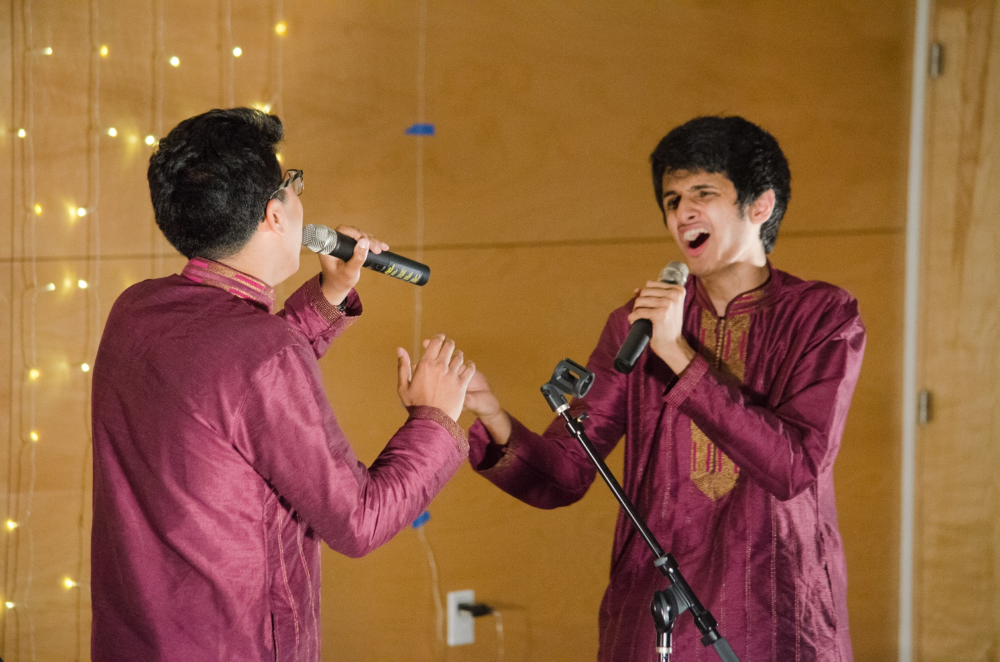

So I know it's been over a month since the end of 2018, but this is something I really wanted to do to start off my blog in 2019. On the one hand, I'd like to say that my 2019 has been so exciting that the last six weeks have eclipsed the last year so totally that I've forgotten everything that happened. On the other… that's the farthest thing from the truth, so I might as well try to relive last year for my avid readers and paint it in as exciting a light as I can.

_**Aside**: There's a million different year reviews (and corresponding year review formats) out there, but I particularly enjoyed [Karishma's year review](https://medium.com/@karishma.mandyam/what-happened-in-the-last-525-600-minutes-4183fd7f6cb1), so I decided to be a millennial about it and pretty much copy her format. Thanks Kayrish!_

---

# January

The year 2018 started off with an exciting but difficult decision: committing to working at Illumio, a networking security startup in the Bay Area. When I flew down to the office for my on-site interview, there was an energy in the office that really spoke to me, and I couldn't help but feel like Illumio was the place for me (turns out that energy was partly because lunch had just been delivered, but my point still stands). Now, just over a year on, I am totally in over my head, constantly adding to a laundry list of things I don't understand, but loving every minute of it. I'm finally starting to understand what all the uncles and aunties say about learning things in industry that can't quite be taught in the classroom. And most excitingly of all, I've started a Game Night tradition, which is easily my biggest contribution to the company.

<figure>
    
    <figcaption style="text-align: center; padding-top: 2px; font-size: 85%;">My grandparents visiting the first Illumio office in October!</figcaption>
</figure>

Committing to Illumio in early January now meant that I could really take my foot off the pedal and enjoy my last few months at college. And boy, did I.

# February

With slow, cold February really giving me an opportunity to stop caring about school, school seemed to make sure I'd regret not caring about it. In Winter quarter 2018, I took NLP in the hopes that it would be different from my disastrous ML experience, and found those hopes dashed quicker than I could say "Backpropagation through time for recurrent neural network language models" (yes, I went back to the [447 website](https://cs.uw.edu/447) to look up a fun term to use for that line). So my penultimate quarter gave me my worst performance in a class at the UW  &mdash;  a fine way to round off senior year. I did learn though, in a pretty harsh way, that it's okay to not love and be good at every part of computer science. Now I know it's best to just stick with the trusty 1's and 0's.

<figure>
    
    <figcaption style="text-align: center; padding-top: 2px; font-size: 85%;">Don't really have any picture to go with this, but I'm glad we can all laugh about this now</figcaption>
</figure>

# March

March marked the culmination of probably the most impactful experience of my time at UW. This would be my very last quarter being a teaching assistant for the undergrad CSE courses. From barely making it as a 143 TA off the waitlist 3 years ago (to the person who opened up a spot for me: I am eternally grateful) to TA'ing Distributed Systems in my final quarter, being a TA more than anything else made me feel like I was doing what I was meant to do in life. I don't quite know what the next few (or many) years have in store for me, but I know that I'll carry the giddy rush that I would get right before the start of weekly quiz sections with me forever (and the Bob Bandes TA Award Honorary Mention plaque hehe).

# April

Kinspire also made some exciting steps this year through one of my favorite events we've put on: the Innovation Challenge. After attending sundry hackathons through the years, this event was more of an interdisciplinary ideathon (love that description) focused on Kinspire's mission, with teams working to think of creative solutions in categories: hardware/software, policy, and campaign. I'm proud of the work that went into the event, and even more impressed by the dedication our participants showed, coming up with fantastic project proposals that we could actually put into action. The Innovation Challenge was definitely a huge step for Kinspire, and I'm looking forward to all the great work we'll do in 2019 (and maybe even a round 2?? Probably not).

Insert picture here.

# May

May 20, 2018. Aarohi 2018. The final chapter of the club that gave me my first family at college: Awaaz. After four years of pouring my heart and soul (and vocal cords) into the University of Washington's premier South-Asian Fusion A cappella team, it was finally time to pass the baton to the next generation of singing sensations unburdened by instruments. I can't really fully go into how much Awaaz influenced my college experience, because I'm pretty sure that would overflow the "\_\_\_ minute read" algorithm at the top of this post, but Awaaz gave me a priceless musical outlet (which was crucial because I barely had any other creative outlet), some of my closest friends in college, and an essential platform to grow as a leader. Aarohi '18 ended this journey perfectly with our senior song, a tour de force in and of its own right. ["Who lives, who dies, who tells your story?"](https://open.spotify.com/track/7EsSVPxaYoAZjQwhspJBs2?si=vjkJEPoERoqpJWFiWWwFpA)

<figure>
    
    <figcaption style="text-align: center; padding-top: 2px; font-size: 85%;">I know Govind will tell my story ♥</figcaption>
</figure>

# June (pt. 1)

_I know this is cheating because I have two things to talk about for June, but I promise I'll cut down elsewhere. Don't hate me pls thx_

As the month that had been on my college transcript for forever under "Graduation Month" finally arrived, I felt… nothing different, to be quite honest. The weeks leading up to graduation were more of a blur than anything else. A few highlights (besides the ceremonies themselves, to be fair) that stand out in my memory are receiving an Honorable Mention for Bob Bandes TA Award at the CSE graduation ceremony (and hearing Professor/Living Legend TOM ANDERSON talk about my achievements), and my CSE Honors research presentation. I had been doing research with the MISL Lab throughout my senior year, working on the Microfluidics project under the DNA Storage focus area. It was an immensely proud moment to deliver my final honors presentation in front of Professor/Angel in Human Form LUIS CEZE, friends, and family. Both of these memories served to reinforce my love for academia.

# June (pt. 2)

Wow. I did it. 4 years of college in the books… the questions everyone asks themselves fill my mind: Have I grown? Am I a better person than I used to be 4 years ago? Am I equipped to make decisions that will affect my life, the lives of those I love, and society at large? The time right after graduation truly is a deeply introspective one. But I decided to put those questions off until a later time and instead enjoyed an awesome ROOOADDD TRIPPPP to Portland with Sidd, Esha, and Kavya. Now that I was done with college good and proper, I could relax and enjoy an amazing visit to Oregon. Paragliding, swimming in a river, failing to flyboard, losing my phone due to swimming in aforementioned river, feeling like death because of my cat allergy, going to a shooting range for the first time &mdash; this trip had it all. We definitely missed Reksha though. :(

<figure>
    
    <figcaption style="text-align: center; padding-top: 2px; font-size: 85%;">Something something modern-day three wise monkeys something something</figcaption>
</figure>

# July

_Okay I'll cut this one short because I doubled up on June. Here's the short version:_

- Went on a family vacation to Italy, Switzerland, and Paris (via India)
- Trip was with a Marathi tour group... yeah.
- The tour group was actually really fun. And Europe was, of course, amazing. Otherworldly. Breathtaking.
- Can't wait to go again. Can't. Freaking. Wait.

Insert picture

# August

As is tradition every year, the waning of the sunny days of summer brought with it some new beginnings. Kavya, after years of tirelessly working toward her life goal of becoming a doctor, was finally embarking on the first step of the journey. On August 17, 2018 in front of her friends, family, and soon-to-be peers (and me I guess), Kavya officially received her white coat, joining WSU's second ever class of world-class medical students. Listening to the Dean describe WSU's mission of serving and dedicating one's life to the underserved was surreal, because I could not believe how Kavya had found a school whose goals matched so perfectly with hers. This was, of course, a huge moment not just for her career, but also for what it meant for us in the coming months. 2018 had not been short of challenges that we had to overcome together, but this would be a huge one: Kavya engrossing herself in the study of the human body in snowy Spokane, WA, and me working all the way down in Sunnyvale, CA. But, as with every hurdle we've overcome, this seemingly insurmountable one has only made us stronger. Most importantly, my heart is happy because I know that Kavya is finally doing what she loves, and she's a step closer to her destiny of making her indelible mark on this world.

<figure>
    
    <figcaption style="text-align: center; padding-top: 2px; font-size: 85%;">Clearly I forgot whose big day this was...</figcaption>
</figure>

# September

For the first few weeks on my first job in the Bay, I stayed with some extremely kind and gracious family friends, living in true luxury with delicious home-cooked Indian meals for dinner. September, however, marked an exciting new step in my "adult life" (yikes): moving into my own place. Now at last I was wholly responsible for my own well-being, away from family back in Seattle. From figuring out what to eat, to cleaning, to running adult-y errands, to establishing a routine, the onus was squarely on my shoulders to start maintaining a good lifestyle. But the challenge was a welcome one, and this more than anything has helped me become more self-reliant since then.

# October

As the weeks crept by at work, and that routine I briefly mentioned earlier started materializing, I started branching out a bit and putting more time into other pursuits outside of work. One of these pursuits that you could say "kicked off" in October was joining the boards of ASA and A3. Although I've left my Awaaz days behind, I found that the South-Asian A cappella community had not quite yet deserted me, and there were still a whole lot of people passionate about giving back in their own way. Both organizations are still in their infancy, since this is only the third year of A3 and second year of ASA. It's been a fantastic few months, as I've been able to get involved with the development of the circuit as well as some technology-related projects (stay tuned for more!), and I'm incredibly excited to be a part of the circuit's growth!

<figure>
    
    <figcaption style="text-align: center; padding-top: 2px; font-size: 85%;">Attending Anahat 2018, the second official A3 bid competition!</figcaption>
</figure>

# November

<figure>
    
    <figcaption style="text-align: center; padding-top: 2px; font-size: 85%;">The quintessential view of Yosemite (credit: Sharon)</figcaption>
</figure>

The work routine seems to excel at making it easy to slip into a mind-numbing rhythm without big moments like I had had in earlier parts of the year. Early on in November though, I was jerked out of my torpor with a road trip to Yosemite National Park. And by God, what a way to break away from monotony. After the incredible vistas of Switzerland in the summers, Yosemite did its part to temper my unquenchable thirst for nature.

<figure>
    
    <figcaption style="text-align: center; padding-top: 2px; font-size: 85%;">So many good photos, I can't choose which one I like the most</figcaption>
</figure>

There were so many moments in the trip and the treks we took in the area where I was actually struck dumb by Mother Nature's sheer grandeur. The brilliant stars at night (properly visible away from civilization), the all-too-familiar evergreen foliage, the towering monoliths of mountains - it was unbelievable. The trip to Yosemite also made me commit to exploring more of the world around me in 2019.

<figure>
    
    <figcaption style="text-align: center; padding-top: 2px; font-size: 85%;">Promise this wasn't staged (credit: Sharon)</figcaption>
</figure>

# December

December brought with it the true holiday season (although the American capitalist economy tried to convince me it started in mid-September with its (fake) "sales" and "special events") and the prospect of flying to India for Rahul's wedding. Although it was a short trip by my ideal standards for India trips, it was packed to the brim with action and memories. The four-day stretch leading up to the actual wedding day seemed to last a month, with all of the events and ceremonies and dance practices for the Sangeet. Most of all, it felt soooo good for the 8 cousins to be reunited with each other for the first time in half a decade.

<figure>
    
    <figcaption style="text-align: center; padding-top: 2px; font-size: 85%;">The 8 Pethe cousins... welcome a new member to the family!</figcaption>
</figure>

The wedding was a spectacular event, and I wish the happy couple all the best!! But before you ask,

1. Yes, I did [sing](./dec-singing.jpg),
2. Yes, I did [dance](./dec-dancing.jpg),
3. Of course I stole the stage, and
4. [Here is a video of both](https://youtu.be/dQw4w9WgXcQ).

---

Welp. That's that, I suppose. Thanks for reading all the way through, I guess? Sorry about all the parentheticals btw, my thoughts are continually all over the place and that was the best way to write them down.

All in all, 2018 did indeed seem to be quite a busy year. Let's hope 2019 can hold its own!

See you all in "two weeks" (probably next year).
