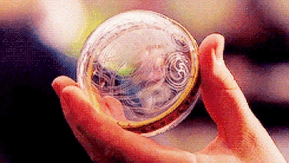

_A meandering stream of consciousness about memories, remembering things and not remembering them, with some real memories sprinkled in._

For as long as I can remember, I've had bad memory.[^1] One thinks one would come to terms with such an affliction. But every so often, I'm gripped by a soul-deep anxiety because I can't stop thinking about the many important things, people, memories, and places from my life that I can no longer recollect. It's paralyzing, knowing that I've lived a whopping $27 \times 365$ days on this Earth and yet struggle to remember the last one. Who am I, what is my identity, if not the sum of my lived experiences? If I can't even point to those experiences and say, "I was there. I did that. I lived that," then... what has it all been about?

In true 21st century 20-something fashion, I've chosen to first cope with the **symptoms** rather than try to address the root of the problem. This solution is simple: obsessively try to hold onto anything and everything I can that will help me remember as much of my past as I can. I have box upon box of truly the most random yet strangely meaningful items through the years: a faded train ticket from a visit to the DC area, a math notebook from 5th ~~grade~~ standard where I scored 100% on every quiz for a 5-month stretch, my first Stargram[^2] from a high school theater production: the list goes on and on. Going digital has certainly enabled my hoarding, further spurred on by my obsession for organizing and categorizing things in general. In my advanced age, I've even started writing down stories or memoirs of my admittedly short and uneventful life to fill in the gaps between the keepsakes. Paradoxically, I can't remember the last time I actually cracked those crates (digital or physical) open and checked out those compulsively collected curios &mdash; in my head there's some undefined point of time in the future when I'll sit back and turn back the time. Hoard now, reminisce later: that's the mantra.

<figure>
    
    <figcaption style="text-align: center; padding-top: 2px; font-size: 85%;">A metro card from the best public transport system I've experienced</figcaption>
</figure>

Of course, I'm not a perfect hoarder; while the gaps in the artifacts of my life history may be intermittent, they sure stick out like a sore thumb. I lost all of my photos from a year and a half of college: I had only saved all of them to my laptop, and one day my laptop just stopped working abruptly. Poof. Gone. More recently, I forgot to back up all of my online documents that I'd saved to my UW Google Drive account during undergrad, before the account expired and the Google I trusted so dearly swallowed all of them whole. Hardest to reckon with was the loss of all of the sheet music I'd worked on with UW Awaaz. And I'm sure there are loads of precious memories that I **could** have held onto with some associated item, but didn't.

I guess if I'm being fair to my hippocampus[^3], I do remember some important things of my own accord. Sometimes things come back to me totally randomly, brought on by a random phrase someone said, or driving on a road I might have driven on before. But my favorite "memory trigger" of all is music. So many songs that I listen to are a veritable Pensieve memory, taking me back to the time and place in my life that I associate with that song. I love chasing those threads down and boring whoever's around me with the story every time I hear a song that's in this special echelon. I've even resorted to organizing my Spotify playlists by the 6-month interval in which I discovered the song, because the songs I listen to invariably end up putting me right back wherever I was in life at the time. A favorite song-memory that I always go back to is this sort of half-formed memory from when I was maybe 6 or 7 years old. It was late, and my dad and I were waiting at the erstwhile[^4] Sammamish Regional Library for my sister's daycare to finish. All I remember is me sitting by the window, my face pressed up against the glass, watching the nighttime traffic on 228th go by. And the song that triggers this memory? "Sacrifice" by Elton John.

<iframe src="https://open.spotify.com/embed/track/0e3yhVeNaTfKIWQRw9U9sY" width="100%" height="350" frameBorder="0" allowtransparency="true" allow="encrypted-media"></iframe>

As for why that memory is tied to this particular song? I have no idea. Maybe it was playing in the library at the time, or maybe my dad played it in the car on the way to/from the library? Whatever it is, that song always puts me right back in that spot at age 6 (or 7). I could go on and on with many more songs (See: "Weekend Mornings", 2016 memory), but I'll save that for an 8-hour road trip when people are stuck in the car and have no choice but to listen to me ramble.[^5]

Now at the start of writing this post, in perhaps overly dramatic fashion (as I am wont to do), I made it seem like this horrid affliction is something only I face. However, with a bit of time and vomiting of my thoughts onto the page, I should acknowledge that is a bit of an exaggeration. At this stage let me throw my good friend [Siddhesh](https://siddhesh.substack.com) under the bus a bit.

After an incredible Tame Impala concert in 2021 in Washington, D.C., Siddhesh and I got some food on the streets near Capital One Arena, and this exact topic came up. It had been a few years since we'd hung out, and just under 11 years since we had been at Gurukul together, and so much of it felt like a blur all these years later. Perhaps the concert had struck a chord in us (it was, of course, part of the _The Slow Rush_ tour &mdash; more on that later), but our conversation quickly turned to reminiscing and bemoaning the fact that such an incredible and formative part of our life felt like something in our mental periphery that we could never truly and fully remember. A few months later, I stumbled upon some audio recordings I had taken of a random day in 9th ~~grade~~ standard, self-assured at the time that those low-fidelity, hard-to-understand snippets of audio would be sufficient to call Future-Me back to that place and time easily. But now, as we listen back, they merely elicit flashes of simpler times, and nothing more... and surely the more time passes the more we will forget. In [the poignant words](https://theoffice.fandom.com/wiki/Finale_Quotes) of Andy "The Nard Dog" Bernard:

> I wish there was a way to know you're in the good old days before you've actually left them.

All around us today are countless examples of how we as a species have tried our best to conquer the withering away of memories and lived experience, starting with the revolutionary invention of language and telling stories, all the way to the insane ease with which we can capture our life experiences in photos and videos. Apps like "1 Second A Day" and "BeReal" try to make this a bit more streamlined, focusing on just trying to capture a single second from each day. So much of Hollywood runs on productizing nostalgia: taking the experiences and memories people cherished from their childhood and converting them into something people will not hesitate to spend money on. How many reboots of old series were produced in the last couple years alone? On the other hand, well-crafted stories about the complicated relationship we have with memories, like the movie _Memento_ (one of my favorites), resonate so strongly with people.

<figure style="display: flex; flex-direction: column;">
    
    <figcaption style="text-align: center; padding-top: 2px; font-size: 85%;">"Only problem is, I can't remember what I've forgotten."</figcaption>
</figure>

So what is it about memories that are so fundamental to the human condition? I guess at the core of it all, it boils down to time. Time, the great equalizer, the great healer, the eternal, the one resource we all share, and the one we all lose in equal quantities no matter what we try. And memories? The process of making memories is, in fact, us fighting back against time's inexorable advance. But, of course, it's always a losing battle, because as a potentially sociopathic and intensely misogynistic anthropomorphic fictional horse [once said](https://bojackhorseman.fandom.com/wiki/The_Old_Sugarman_Place/Quotes):

> Time's arrow neither stands still nor reverses. It merely marches forward.

Every key I hit (especially `Backspace`, which I've probably hit the most during this post) takes away a smidge [^6] of my time away that I can never get back. I don't have to look hard in the corpus of human experience to find treatises and poems and essays and eulogies about time. My favorite example, not so unpredictably, comes from the world of music.

I present Exhibit A: the aforementioned _The Slow Rush_ by Tame Impala. This album definitively owned my 2020 music rotation [^7] by a wide margin. An absolute masterpiece from start to finish, this album (Tame Impala's fourth) was the first one released after I started actively following him thanks to &mdash; I kid you not &mdash; a Ford Edge commercial during a football game. [^8] The theme of this album, as I see it, is time. Every song examines a different aspect of how time &mdash; the past, the present, and the future &mdash; impact the human experience. Even the title, _The Slow Rush_, is emblematic of the duality of time. The ticking of time can be slow; just listen to the wall clock (if you still have one) at night when you're trying to sleep. The interval between each `tick` and `tock` lasts an eternity. And yet some days go by in a blink of the eye, more so now I'm older. Did they really happen, or did we Daylight Savings a whole day instead of just an hour? Take the track "Borderline" for example: the theme in this song directly connects to the feeling I share of trying to grab onto something to slow the passage of time, but knowing only too well that your grip is tenuous at best:

> We're on the borderline / Caught between the tides of pain and rapture,
>
> Then I saw the time / Watched it speedin' by like a train / Like a train.

Hits me right in that vulnerable spot, every time.

<iframe style="border-radius:12px" src="https://open.spotify.com/embed/album/31qVWUdRrlb8thMvts0yYL?utm_source=generator" width="100%" height="352" frameBorder="0" allowfullscreen="" allow="autoplay; clipboard-write; encrypted-media; fullscreen; picture-in-picture" loading="lazy"></iframe>

Now, after putting it off long enough, perhaps it's time to address my anxiety at its source.

First and foremost, I need to try to reconcile the importance of living in the moment and the almost addictive need to save it for later. It's a pretty ironic state of affairs: on the one hand, with how easy it is to take a photo or video, all I end up thinking about when I go somewhere or am doing something fun is the million possible options and ways I could take a photo. On the other hand, with how easy it is to take a photo or video, I should be spending the least energy on doing so. If I needed to worry about how much film I had on hand, or whether I had enough AA's for my disposable camera, I could make a case for doing it properly. But hell, I can just take 20 photos without even thinking about it. So... why think about it? The less energy I spend on the notation, the more I might be helping my brain actually remember things, the more I'm able to live in the moment. Soak in the moment through all of the senses, able to accept that I will never experience this exact moment ever again, and that's okay. This is probably a very obvious and not insightful conclusion for the general public, but I think some part of me needed to actually write it for myself.

Zooming out a little, I have to come to terms with this idea of "accepting defeat at the hands of time". This defeat manifests in many forms: forgetting the past, of course; carrying regrets around all your life; leaving the people you love, not knowing when you'll see them again; and the list goes on. Every time, it feels unfair, like some gross injustice is being levied against us. But this is just the reality of the world we live in. I don't know if I've fully internalized this yet &mdash; I'm still riddled with indecision at all times, and I constantly harp on decisions I made in the past that I can't do anything about. But I'm hoping this gets me a step closer.

To answer the question from the beginning, "Who am I if not the sum of my lived experiences?", well &mdash; that **is** who I am, even if I don't remember every single one. Who knows where I'll be 3, 9, 27, 54 years from now? Who knows if I'll be able to remember sitting here, writing this sentence? But if I'm able to live in the moment all the way through as much as I can, I know I'll have remembered to do one thing in my life right.

P.S.: It took me about a year and 5 months to actually finish writing this. That's a big win for Time and a lot of new memories I've made & forgotten since I started. Yikes.

[^1]: I guess that means that I _might_ have had good memory at some point... but I don't remember that, so I can't be sure.
[^2]: A stargram was a cute little "Congratulations on performing in this play!" to a member of the cast/crew that an audience member could pay for
[^3]: Is my brain me? Or is it a separate entity? But what is my identity without my brain thinking about that identity?
[^4]: [A fun little read](https://www.historylink.org/File/20301) told me that the library where this memory happened is not where the Sammamish library is located in the present day. Funnily enough, the old library was at 825 228th Ave **NE** while the current one is at 825 228th Ave **SE**.
[^5]: You, sadly, always have the option of closing this tab. I hope you don't though.
[^6]: If you're curious, I type at ~600 CPM so each key would use up roughly 0.1s.
[^7]: So you can bet my easiest access point to 2020 memories is listening to this album 🙂
[^8]: Check it out here if you don't believe me: https://youtu.be/aWNTCdpg7qo. The sample from "Let It Happen" starts at 0:11 and the part after 0:23 is possibly one of my favorite guitar solos of all time.
