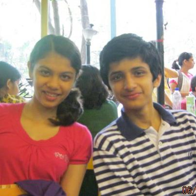

_TL;DR: Probably a good idea. This is basically an account of some of my most memorable weekend memories. Nothing else of use in the intro, skip to [the main part](#the-memories) if you're actually here to read interesting content._

Anyone who knows me relatively well will know that I pretty much am the definition of "night owl". Even when I joke about waking up early, it doesn't go well for me:

> Them: "So do you like waking up early in general?"
>
> Me: "Yeah, you know, I'm kind of an early worm..."

Exactly. It doesn't really make sense: if I were the early worm, I'd get eaten by the early bird.

As a result of staying up late, the normal "morning hours" are a thing of mystery to me. Sure, through high school I had to wake up at ungodly hours on the weekdays, but I usually didn't wake up fully until period 3. In college, after a disastrous fall quarter freshman year where I had an 8.30AM class a 25 minute walk from my dorm, I vowed never to take a class before 10.30AM if I could manage it, and I certainly was able to, save a few annoying exceptions.

All this to say, I don't like waking up early.

As for **weekend** mornings, those are pretty much nonexistent, because while there's usually a good reason to be up in the mornings on weekdays, there usually isn't any on Saturday or Sunday. Yet for some unspeakable reason, certain weekend mornings stand out in my memory like tall skyscrapers built by real estate magnates amidst a sea of slums. Perhaps it is precisely their otherworldly nature that gives them that importance, or perhaps it's a subconscious message from my brain telling me to wake up earlier. Either way, I thought it might be nice to firmly cement these memories, and maybe even give them more meat by way of trying to remember everything that happened.

Enjoy!

## The Memories

### Winter mornings, c. 2001-2003

I wake up like a good boy by I wanna say 7.30AM. I brush my teeth, rinse my mouth, and take a quick shower, thanking all of the water bodies for giving me water to wash myself with (from Narmada River to Lake Washington). I run down the stairs, only to find my favorite Blue's Clues cereal bowl waiting for me on the dining table filled with Cheerios, and Aai[^1] getting what must be her own adult breakfast ready in the kitchen. I talk to her about whatever random thought pops into my head, as is the norm for a 2nd grader. Baba[^2] joins us a few minutes later. After shoveling down a bowl full of God's gift to children, I grab my backpack and sit on the second stair to velcro my shoes on. Once Baba is ready to go as well, I look to the little picture of Ganapati that we have next to the front door, and recite the daily morning prayer. I'm pretty proud of how well I have it memorized. Now that we're all set, it's time to take on the world! I jump-skip to the car, enjoying briefly the feeling of the chill Redmond air on my face. I wait impatiently in the back seat for Aai to start the car and start driving to Marathi class at the Disha office. As we drive down the main road, I plaster my face against the window, staring at the sad-looking trees passing by, long bereft of both pink spring blossoms and autumn leaves. Before I know it, we're pulling up into the parking lot, and I excitedly look out the window for familiar cars. I spot my best friend's car just a few spots from where we parked. I jump out the second the car pulls to a stop (but not before - Baba would get mad if I did that!). Baba and I head to the office, and I just can't wait to get to learning Marathi with my friends.

Isn't life wonderful?

### Hike + Wadeshwar, c. 2008

At 6.45AM, Baba's usually inaudible voice trickles through my subconscious to wake me up. I'm slow to wake, but Sanika is already up and getting fresh. How did she get up that quickly? Was she secretly awake and just waiting for Baba's go-ahead? Whatever. I get ready right after her, not quite looking forward to the morning's activities, but not particularly upset about them either. Of course my grandparents are awake and already having breakfast, happy just to see us before we're on our way. I eat the almonds that Ajoba[^3] offers me, our little daily routine, and down a glass of milk. Aai is a minute or two late in coming down after us, but once the four of us are ready to go, we trudge out to the Hyundai Santro. Admittedly, it's a beautiful morning, and I can occasionally even hear the meowing (is that the right word?) of peacocks up on the hills. We drive through Panchavati and I'm once again surprised by how alive the streets are this early. We park the car at the foot of the hill after a short 2 minute drive, and commence Baba's favorite hike.

Conversation is sporadic, but I like it that way. I walk a few paces ahead of the rest, my unreasonable pride refusing to let me walk slower even than my family. As we trek through the trees, I try to appreciate the nature around me, but all that matters to me in this moment is that I make it to the summit as fast as possible. This doesn't quite work out, since every few minutes I have to wait for my family to catch up anyway. Frustrated, I decide to just walk at a slower pace, forcing myself to look around properly. 30 minutes from the start of our ascent, we emerge from the thickest of the foliage to the flat plateau at the top of the hill. This is my favorite part of the whole trek: you can just about see the rest of the city over the trees on all sides, and there's a brilliantly blue pond hidden away in a quarry-like crevasse. I spot a few couples meandering around the banks, talking about whatever couples talk about. God only knows. After a quick trip around the top of the plateau, we head back down, painfully aware of how hungry we all are. The way down is faster, and correspondingly worse on our knees &mdash; or I should say, on my parents' knees. My knees are, of course, unbreakable.

We hurriedly pile back into the Santro, and head over to the Joshi family's signature breakfast place, Wadeshwar. Baba hadn't told us this before now, but we are apparently meeting some family friends there, which made me a lot more excited for the upcoming breakfast. The expected 10-15 minute wait for the table feels more like an eternity, but when they finally call Baba's name, we've already decided our orders. To be honest, mine is always the same, so I really had my order ready before we'd even arrived at the restaurant. Once the food is served and I fill my mouth with the biggest bite I can manage, I lean back in my chair, satisfied at last. Uttappas never tasted so good.

### High school "morning", c. 2012

I groggily open my eyes as my mom knocks on my bedroom door. I make sure it is my mom, because if it's my sister I'm going to be mad. I roughly make out what she's saying: "It's 11:30, we need to be at a lunch by 12!" I groan internally, fully aware that "waking up late" wouldn't really count as an excuse for being late at a lunch scheduled for noon. For the 2000th time, I regret staying up beyond 3am the previous night for really no reason whatsoever. While I did get around 8 hours of sleep, it sure as hell doesn't feel like it, which makes sense considering that I'd slept for less than 5 every day the preceding week. I'm grumpy, I'm tired, I'm hungry, but most of all I feel gross. I sit up and check my messages on my trusty Nokia Lumia 700, when there's another knocking on the door. This time it is my sister, and the second I realize it is her, I shout "Calm down, उठलोय मी!" ("Calm down, I'm already up!") Unwarranted and unnecessary, sure, but I'm annoyed. Definitely more at myself than at her, to be honest, but there you have it. It takes 20 minutes for me to get ready, my already slow pace slowed down further by my lack of interest in this lunch.

The whole time, I have only one thought: if only I could sleep till 2pm and play video games all day. One day when I'm done with school and living alone, I resolve, I'll fulfill this seemingly impossible dream.

### Summer alone in the US, c. 2014

I wake up naturally, without an alarm (electronic or human). For a few seconds I'm not sure where I am, but then the unusually fluffy and warm comforter makes it clear that I'm back in the US, in particular at Atya's[^4] house. I get up and out of bed with an unusual spring in my step for this hour, and glance at my phone - it's 7AM. Jetlag after returning from India at work. I hear the occasional bird chirping, but otherwise the lack of sounds is almost oppressive. I'm listening for the absurd music that plays when cars are reversing (take your pick from Careless Whisper, Fur Elise, or bizarrely Rudolph the Red-Nosed Reindeer), the casual cross-society shouted conversation, and the constant buzz that means people are around &mdash; but all I hear is the occasional hybrid driving by with the faintest of sounds. I peek through the window shades, looking for a sign of life, but all I see is the quintessential Seattle spring morning: pale blue sky with the occasional clouds. After a few moments realigning my internal GPS and system clock, I go to the bathroom and get fresh. I walk downstairs more slowly than usual, once again reveling in the silence. I know I'm the only one up, since Atya likes to sleep in a bit on the weekends. The blinds are down, but the sun is bright enough to bathe the living room in a soft orange glow. I grab a bowl Honey Nut Cheerios© (some things don't change) and moodily eat at the dining table, not really thinking about anything.

For those few moments, it feels like I'm the only one awake in the world, and the rest of the world is still in a slumber.

### Trip to Swedish with Kavya, 2016

I'm rudely awakened by the death-knell of the default Android alarm clock. I turn over, waiting for Kavya to turn off the alarm. 5 seconds pass, then 10... Every "beep beep beep beep" (you know how it sounds) is like a knife in my heart, making it skip a beat like the end of the world is upon us. I turn back over, squinting with one eye, to realize Kavya already woke up a while ago and is finishing getting ready. I fumble with my phone, just about managing to turn off the alarm within another 10 seconds. As I turn back over, slowly being whisked away by sleep, the sweetest of temptresses, a somewhat less sweet temptress calls "Sarang! Get up, we need to leave in 2 minutes!" I can't really ignore that, now can I. 7 minutes later, with the clock showing a delightful 5.50AM, garbed in a barely-passable-in-public outfit, we leave Stevens Court, on our way to Swedish Hospital at Cherry Hill for Kavya's morning shift for the Prep Step program. Why the woman wants to pursue the infernal occupation of being a doctor is in this trying moment beyond me. I suppose it's my job to be supportive and help out where I could, though, and she needed a ride, so there I am. All of this is running through my head as I get into my trusty Acura. As we drive off, the conversation steadily picks up, and the tiredness slowly fades away. At one point "Marhaba" from _Malli Malli Idi Rani Roju_ starts playing, and we get lost in trying to sing along with it. The end results of the drive, basically, are that (a) I'm much less salty about being up at such an ungodly hour, and (b) dawn had truly broken, giving the sky a beautiful glow.

We pull into the Swedish Hospital's parking lot, looking for a spot up on the 4th floor. I have my laptop to do some work, but I'm not quite sure where I would be able to work, so I walk with Kavya to the main hospital building. The brisk Seattle morning air firmly kicks out any last vestiges of sleepiness I may have. Kavya hastily says goodbye in the relatively empty lobby, and rushes up to her shift as I glance around for a work area to take refuge in. I spot a comfortable-looking cushioned seat, decked out with full back support (i.e. it's right up against the wall). I settle down and pull out my laptop to get started on the latest CSE 331 project that's due early the following week.

For the first few minutes I'm just getting situated, having only just properly woken up. I put my headphones on, and think about what to listen to while I'm working. The answer is as clear as a message from the heavens: the last song Kavya and I listened to right before we parked. Ek Pal Ka Jeena, from _Kaho Na... Pyaar Hai_. After 2 minutes of opening up the assignment and Eclipse, it hits me that this song might just be the single greatest song to ever be recorded by mankind, and without a moment's hesitation I turn on the "repeat this song forever" option. I crack my knuckles. It's go time.

The next 2-3 hours fly by. I can't quite describe the feeling: on the one hand, I'm very aware that I'm in a hospital lobby, with the occasional patient walking past, sometimes accompanied by a medical professional or two; but at the same time I'm completely immersed in the project and the overpowering atmosphere of the song. I'm creating Java classes, setting up `HashMap`s and `TreeMap`s like a goddamn cartographer, designing the project data's graph layout, and I feel like Neo after he realizes he's the One. Complete clarity. Every refrain of "Ae aaye aao aaye aa" feels like an energy drink injected directly into my bloodstream. In those few hours, I finish more than I'd ever done in that small a time period. Simply put, I've transcended to the uppermost echelon of productivity.

This transcendence must, however, eventually come to an end. After Kavya wraps up her shift, she comes down to pick me up and apologize again for making me wake up so early on a weekend. Little does she know that I've just had an out-of-world experience like no other. I dismiss her ridiculous apologies, finally turn off Lucky Ali's heart-rending and seemingly never-ending voice, and put my laptop away. We head to Starbucks to grab a late breakfast, and head to the parking lot.

Everything around me has a different air to it. Even Kavya's boring accounts of dealing with patients seem interesting in that moment[^5]. I try to explain what my few hours were like, but I can't quite put it into words, and just end up telling her how grateful I am that she asked me to drop her off this fateful morning. She thinks I'm being sarcastic, but I'm really not. We get back in the car, and I wonder if I'll ever be in a mental place like that ever again. Most likely not.

Oh well. Time to resume life on earth.

<iframe src="https://open.spotify.com/embed/track/2YOEKFkS1IWFmZglZx2M3f" width="300" height="380" frameborder="0" allowtransparency="true" allow="encrypted-media"></iframe>

### Last Awaaz Competition, 2018

I don't exactly know why I'm up, but somehow, I've transitioned from barely-asleep to barely-awake. There's a bustle happening all around me, and seconds later I realize I'm in an Airbnb in Los Angeles, surrounded by my fellow Awaazians. I just lie there for a few minutes, listening to the semi-whispered conversation drifting down from upstairs, which is where the real action (people taking showers and getting ready) is happening.

This is it. This is my last ever Awaaz competition. 4 years of arranging and practicing and rearranging and performing, leading up to this terminal moment for me to compete with my team. My other expeditions with Awaaz around the country flash in my mind's eye &mdash; Anu negotiating earnestly with the hotel concierge at Mehfil who wasn't happy about the number of people we were packing into the hotel rooms we'd booked; sprinting from the auditorium at Berkeley to where we were pregaming, clutching Awaaz's first ever trophy; waiting for the last note in Nishant's aalap at the end of Tanhayee at Awaazein, which was the cue to drop our hands. All in the past, though. Now it's time to focus on today.

I open my eyes and sit up, looking around to see who was still snoozing and who'd been responsible enough to get up. I can sense a feeling of nervousness throughout the house as everyone has realized it's finally competition day. I grab my sound check clothes and a towel, and slowly walk up the stairs, exchanging noncommittal "Good morning"s and "Sleep well?"s with whomever I passed. As my brain registers the presence and enthusiasm of the rest of my team, my mind turns to the huge task ahead of us. Somehow, even though I'm distracted by these thoughts, I arrive right as the bathroom is being vacated. I rush in before someone else can steal it, and start getting ready for sound check.

I look at my groggy self in the mirror, and all of my doubts and concerns from the weeks leading up to this moment fill my mind. Now I'm frantically thinking through the rest of the day, trying to remember anything I may have forgotten and making sure I have a concrete plan for the hours leading up to the performance. I repeatedly tell myself I have to be assertive and strict, to make sure we don't waste any time and focus on the task at hand. My brushing gets more and more frantic as the gravity of the occasion starts overwhelming me. I know in my heart of hearts it's not reasonable of me to take full responsibility for whatever happens on stage today, but I can't bear to think about what it would be like to not place and let down my team in my final opportunity to take Awaaz to the promised land once more.

Someone knocks on the door, making sure I didn't fall asleep in the bathroom, and I respond with a "Don't worry, I'm just taking a 2 hour dump." A "pch" from outside confirms that it's Ishanie. Smiling to myself, I get in the shower and start the water. As the pitifully thin stream of shower water emerges from the showerhead, I feel my anxiety lessening a bit. A couple deep breaths later, I can organize my thoughts a bit more clearly. I know it's going to be a tough day, and I know that there's no knowing what's going to happen on stage and whether we'll place or not. But in that moment I make temporary peace with this by thinking about the fact that I'm about to share the stage with 16 of my favorite singers, all of us doing what we love the most (or at least what I love the most; who knows if they really like a cappella). Even the sputtering showerhead couldn't shake that thought from my mind.

And isn't that what really matters?

---

So that's it. Weekend mornings: elusive yet incomparable. You'd think memories like these would inspire me to wake up early more regularly now, right? Well, I think it's safe to say that's not happening.

P.S.: Apologies for the greatly varied story lengths, clearly the more recent ones are more vivid in my memory.

P.P.S.: Once again, sorry about the ridiculous overall length too. Definitely got away from me there. A 18 minute read ain't no joke, yikes.

[^1]: "Aai" = mother
[^2]: "Baba" = father
[^3]: "Ajoba" = grandfather
[^4]: "Atya" = aunt
[^5]: Kidding, of course, those stories are always interesting.
